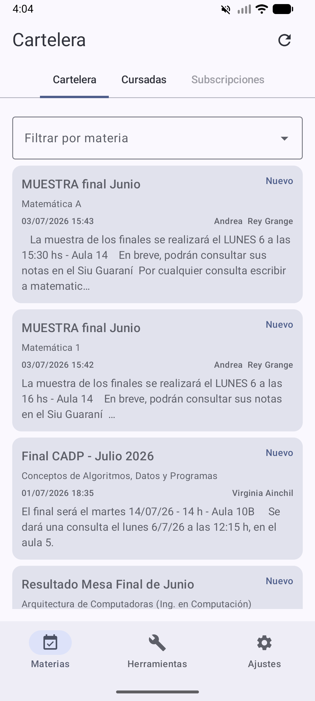
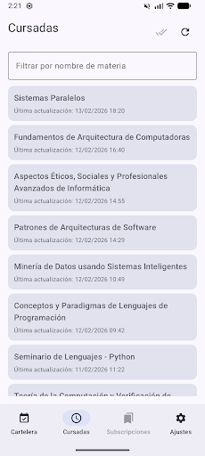
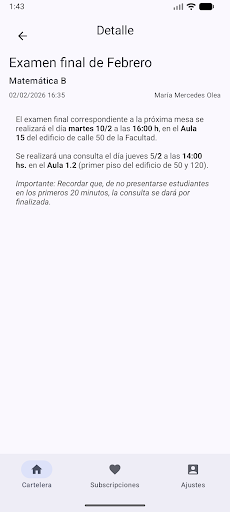

<a id="readme-top"></a>

<p align="center">
  <a href="https://github.com/neftalito/Cartelera-UNLP-App/graphs/contributors">
    
  </a>
  <a href="https://github.com/neftalito/Cartelera-UNLP-App/network/members">
    
  </a>
  <a href="https://github.com/neftalito/Cartelera-UNLP-App/stargazers">
    
  </a>
  <a href="https://github.com/neftalito/Cartelera-UNLP-App/issues">
    
  </a>
  <a href="https://github.com/neftalito/Cartelera-UNLP-App/blob/main/LICENSE.md">
    
  </a>
</p>

<br />
<div align="center">
  <a href="https://github.com/neftalito/Cartelera-UNLP-App">
    
  </a>

  <h1 align="center">Cartelera UNLP App</h1>

  <p align="center">
    Aplicación Android para consultar la cartelera pública de la UNLP,
    seguir materias, revisar cursadas y acceder a herramientas académicas
    como aulas, reservas, planes de estudio, materias optativas y calendario.
    Con notificaciones push cuando aparecen novedades en cartelera o en cursadas.
    <br />
    Hecha con Kotlin, Jetpack Compose y Firebase Cloud Messaging.
    <br />
    <br />
    <a href="https://github.com/neftalito/Cartelera-UNLP-App"><strong>Ver repositorio</strong></a>
    &middot;
    <a href="https://github.com/neftalito/Cartelera-UNLP-App/issues">Reportar bug</a>
    &middot;
    <a href="https://github.com/neftalito/Cartelera-UNLP-App/fork">Hacer fork</a>
  </p>
</div>

## Sobre el proyecto

Consulta datos públicos de `gestiondocente.info.unlp.edu.ar` y
`www.info.unlp.edu.ar`, y los organiza dentro de la app. Permite seguir la
cartelera general, suscribirse a materias puntuales, revisar cambios de cursada,
consultar aulas y reservas, explorar planes de estudio y materias optativas,
ver el calendario académico oficial por año y recibir avisos push con novedades
para todas las materias o aquellas a las que el usuario está suscrito.

## Capturas de pantalla

<p align="center">
  
  
  
</p>

## Funcionalidades principales

- Feed de cartelera con paginación incremental y filtro por materia.
- Subscripciones por materia o recepción global de novedades.
- Apertura del detalle de anuncios, anuncios anulados y avisos generales.
- Consulta de cursadas por materia con seguimiento de la última actualización.
- Visualización del estado actual de las aulas en la facultad.
- Visualización de reservas de aulas por materia.
- Listado de reservas eventuales con filtros por aula y materia, y carga incremental.
- Consulta de planes de estudio por carrera y plan, seleccionando el más reciente por defecto.
- Consulta de materias optativas por carrera y año.
- Consulta del calendario académico oficial por año.
- Modo de pantalla completa para planes de estudio, materias optativas y calendario.
- Acciones para compartir o copiar anuncios, cursadas y estado de aulas.
- Sincronización de tópicos de Firebase según las preferencias del usuario.
- Acceso desde Ajustes a la configuración de Android cuando las notificaciones están bloqueadas.
- Persistencia local para preferencias, suscripciones, materias, cursadas y anuncios vistos.
- Caché en disco y memoria para reutilizar contenido remoto y mostrar datos guardados cuando una actualización falla.

## Tecnologías

- **Kotlin** para la lógica principal de la aplicación.
- **Jetpack Compose** para la interfaz.
- **Firebase Cloud Messaging** para las notificaciones push y la suscripción a tópicos.
- **OkHttp** y **Jsoup** para consumir y parsear la información remota.
- **DataStore** para preferencias, suscripciones y snapshots livianos.
- **AtomicFile** y cachés en memoria para contenido remoto como planes, optativas, calendario, horarios y reservas.

## Arquitectura rápida

- `MainActivity.kt` se encarga del puente con Android: permisos, targets internos de notificación y arranque de la UI.
- `navigation/` concentra la shell de navegación principal, tabs, pager, dialogs globales y encabezado compartido.
- `data/` concentra clientes HTTP, parsing de JSON/HTML, repositorios y persistencia liviana para cartelera, cursadas y herramientas.
- `push/` inicializa Firebase, sincroniza tópicos, recibe data messages, mantiene el canal y arma notificaciones locales.
- `ui/` contiene las pantallas Compose, componentes visuales y helpers de presentación, separados por feature y herramientas.
- `model/` define las estructuras compartidas entre red, persistencia y UI.

## Flujo de sincronización

1. La app inicializa Firebase y registra la instalación actual para poder suscribirse a tópicos.
2. `FirebaseTopicSyncManager` mantiene alineados los tópicos reales con `notifyAll` y las subscripciones elegidas por el usuario.
3. Un backend central consulta cartelera y cursadas, detecta cambios y publica data messages en los tópicos correspondientes.
4. `CarteleraFirebaseMessagingService` recibe el push y `PushNotificationDispatcher` arma la notificación local y la apertura dirigida dentro de la app.

## Estructura de carpetas

```text
.
├── app/
│   ├── src/main/
│   │   ├── java/com/overcoders/unlpcarteleranotifier/
│   │   │   ├── navigation/
│   │   │   ├── data/
│   │   │   ├── model/
│   │   │   ├── push/
│   │   │   ├── ui/
│   │   │   │   ├── ajustes/
│   │   │   │   ├── cartelera/
│   │   │   │   ├── common/
│   │   │   │   ├── cursadas/
│   │   │   │   ├── horarios/
│   │   │   │   └── theme/
│   │   ├── res/
│   │   └── AndroidManifest.xml
│   ├── build.gradle.kts
│   └── proguard-rules.pro
├── gradle/
├── imagenes/
├── build.gradle.kts
├── gradle.properties
├── settings.gradle.kts
├── README.md
└── LICENSE.md
```

- `app/`: módulo principal de Android, donde vive prácticamente todo el código de la aplicación.
- `navigation/`: estructura principal de Compose con navegación, top bar, tabs, bottom bar y dialogs globales.
- `data/`: servicios HTTP, repositorios, parsing de JSON/HTML, DataStore y cachés persistentes o temporales para el contenido remoto.
- `model/`: modelos de datos compartidos entre red, persistencia, push y UI.
- `push/`: integración con Firebase Cloud Messaging, sincronización de tópicos y recepción de notificaciones.
- `ui/`: pantallas de Jetpack Compose y lógica de presentación.
- `ui/cartelera`, `ui/cursadas`, `ui/horarios` y `ui/ajustes`: componentes y detalles extraídos por feature para evitar pantallas monolíticas.
- `ui/common/`: bloques compartidos como renderizado HTML/WebView y acciones reutilizables de copiar/compartir.
- `ui/theme/`: tema, colores y tipografías de la aplicación.
- `res/`: recursos Android como colores, textos, iconos, temas y archivos XML de configuración.
- `app/src/main/AndroidManifest.xml`: declara la app, sus permisos, el servicio de Firebase y la configuración base de Android.
- `app/build.gradle.kts`: dependencias, versión de la app, SDK objetivo y configuración de compilación del módulo.
- `imagenes/`: logo y capturas usadas por el README.
- `build.gradle.kts`, `settings.gradle.kts` y `gradle.properties`: configuración general del proyecto, módulos y propiedades globales de Gradle.

## Cómo compilar y ejecutar

1. Abrir el proyecto con **Android Studio**.
2. Esperar a que Gradle sincronice las dependencias.
3. Ejecutar en un dispositivo o emulador con Android 6.0 (API 23) o superior.

### Configuración de Firebase

Las builds `debug` pueden arrancar con los valores de ejemplo incluidos. Para
compilar una build `release` es obligatorio crear un archivo
`private-local.properties` en la raíz del repo con estos valores:

```properties
firebase.projectId=...
firebase.applicationId=...
firebase.apiKey=...
firebase.gcmSenderId=...
```

La plantilla versionada está en `private-local.properties.example`; el archivo
`private-local.properties` con los valores reales queda fuera de Git.
Gradle valida en un único paso el formato de los cuatro valores, incluida la forma
`AIza...` de la API key, y también que `applicationId` y `gcmSenderId` pertenezcan al
mismo número de proyecto. El runtime reutiliza ese resultado antes de inicializar Firebase.

### Integración continua y publicación

El repositorio separa la verificación y la publicación en tres workflows:

- `android-branches.yml`: ramas distintas de `main` y `develop`; ejecuta tests
  unitarios, lint y builds de verificación, sin abrir un emulador.
- `android-develop.yml`: ejecuta además los tests instrumentados y, después de un
  push exitoso a `develop`, deja la publicación esperando aprobación manual. Al
  aprobarla, genera el AAB firmado y lo publica en internal testing de Google Play.
- `android-main.yml`: ejecuta además los tests instrumentados en los pushes y
  pull requests de `main`, sin generar un AAB firmado ni publicar en Google Play.

Los pull requests hacia `main` o `develop` también ejecutan todos los tests, pero
nunca publican. En los pushes a `develop`, el job `publish` sólo puede comenzar
después de que `verify` termine correctamente y se apruebe manualmente el
environment `google-play-internal`.

Ese environment debe configurarse una vez en **Settings > Environments** con
**Required reviewers** y con los despliegues restringidos a la rama `develop`.
Si la misma persona que hizo el push debe poder aprobarlo, **Prevent self-review**
debe quedar desactivado. Sin un reviewer requerido, referenciar el environment en
el workflow no agrega por sí solo una aprobación obligatoria.

La publicación en producción se realiza manualmente desde Play Console,
promocionando el AAB que ya fue validado en internal testing. De esta forma se
publica exactamente el mismo artefacto, sin reconstruirlo ni volver a subirlo.

El workflow de publicación de `develop` requiere estos Repository Secrets:

- `ANDROID_KEYSTORE_BASE64`
- `ANDROID_KEYSTORE_PASSWORD`
- `ANDROID_KEY_ALIAS`
- `ANDROID_KEY_PASSWORD`
- `GOOGLE_PLAY_SERVICE_ACCOUNT_JSON`

También requiere estas Repository Variables con la configuración Firebase real:

- `FIREBASE_PROJECT_ID`
- `FIREBASE_APPLICATION_ID`
- `FIREBASE_API_KEY`
- `FIREBASE_GCM_SENDER_ID`

La publicación usa `qa`, el identificador de Google Play para el track de internal
testing. La service account debe tener habilitada la API Android Publisher y
permisos de publicación sobre esta aplicación en Play Console.

`versionCode` y `versionName` se mantienen en `app/build.gradle.kts`. El AAB de
testing usa exactamente esos valores declarados en Gradle y los conserva cuando
se promociona manualmente a producción.

Sin las propiedades de firma, `assembleRelease` sigue generando sólo un APK de
verificación sin firma. La configuración de firma y sus contraseñas no se
versionan; el repositorio ignora `*.jks`, `*.keystore`, `keystore.properties` y
`key.properties`.

### Comandos útiles

Compilar APK debug:

```bash
./gradlew assembleDebug
```

Ejecutar tests unitarios:

```bash
./gradlew test
```

Ejecutar tests instrumentados (requiere un emulador o dispositivo conectado):

```bash
./gradlew connectedDebugAndroidTest
```

Ejecutar el análisis estático de la variante debug:

```bash
./gradlew lintDebug
```

En Windows también podés usar:

```powershell
.\gradlew.bat assembleDebug
.\gradlew.bat test
.\gradlew.bat connectedDebugAndroidTest
.\gradlew.bat lintDebug
```

## Contribuidores

Las contribuciones son bienvenidas. Si querés proponer cambios, podés abrir un
issue, crear un fork o enviar un pull request.

<a href="https://github.com/neftalito/Cartelera-UNLP-App/graphs/contributors">
  
</a>

## Licencia

Distribuido bajo la licencia **GNU Affero General Public License v3.0**.
Ver [LICENSE.md](LICENSE.md) para más información.
